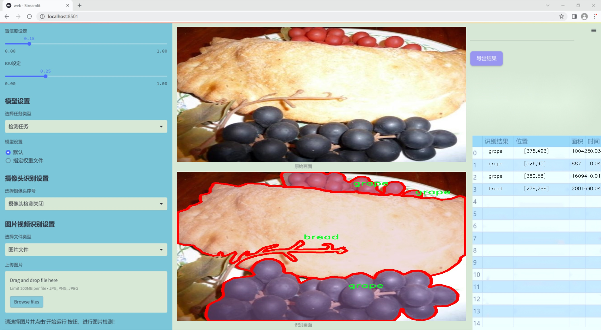
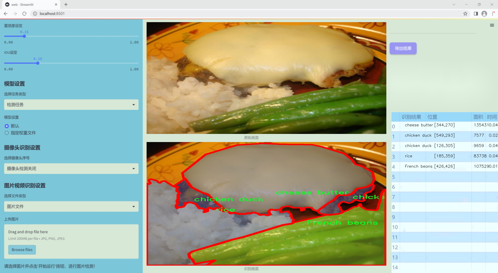
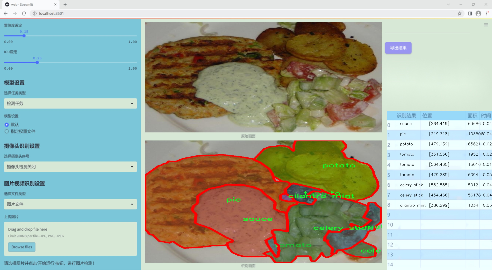
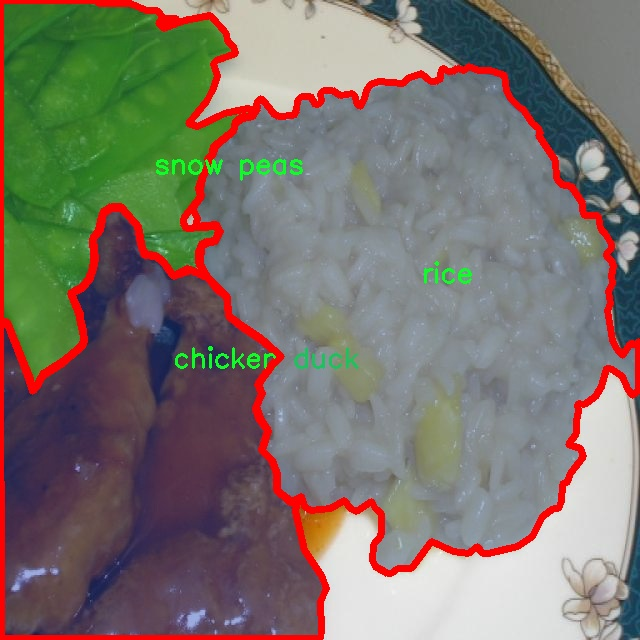
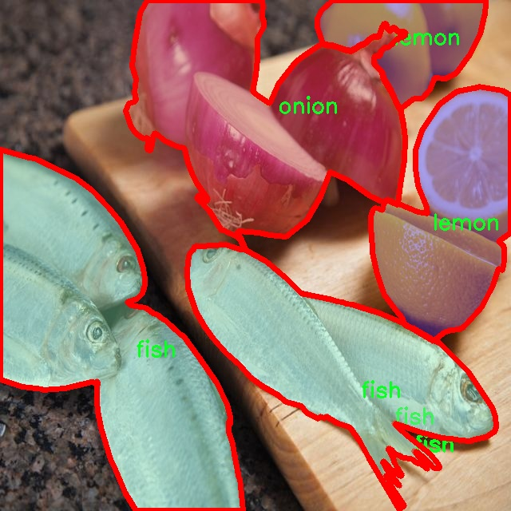
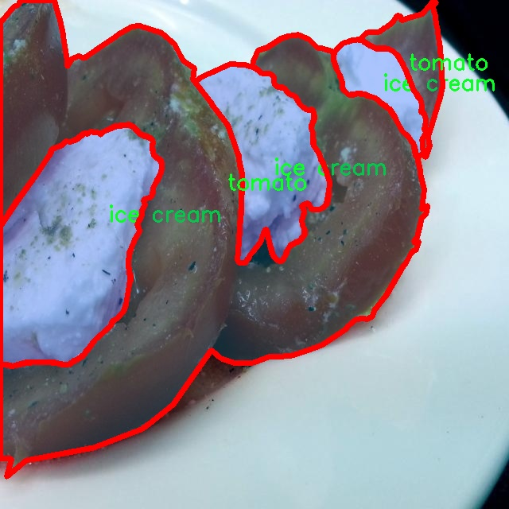
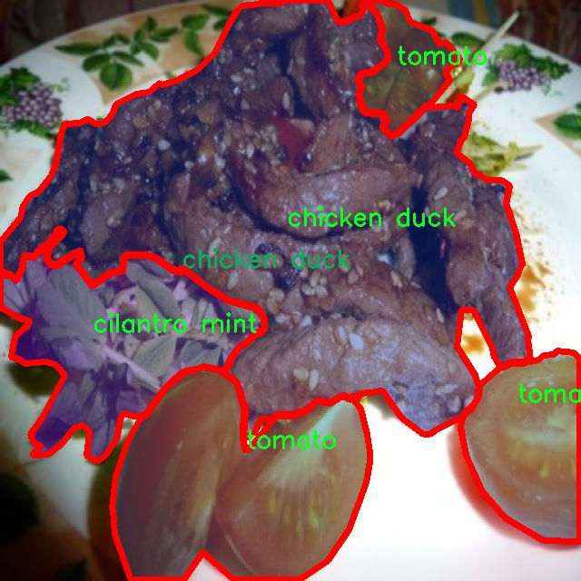

### 1.背景意义

### 研究背景与意义

随着全球食品产业的快速发展，食品安全和质量控制日益成为社会关注的焦点。食品分类与实例分割技术的应用，能够有效提升食品识别的准确性和效率，为食品监管、营养分析以及智能餐饮等领域提供重要支持。传统的食品识别方法多依赖于人工经验，存在主观性强、效率低下等问题，而基于深度学习的计算机视觉技术则为解决这些问题提供了新的思路。

YOLO（You Only Look Once）系列模型以其高效的实时检测能力和较高的准确率，广泛应用于目标检测和实例分割任务。YOLOv11作为该系列的最新版本，进一步优化了模型结构和算法性能，具备更强的特征提取能力和更快的推理速度。通过对YOLOv11的改进，结合FOOD103数据集的丰富类别信息，能够实现对多种食品的精准分类与实例分割，为食品行业的智能化转型提供技术支持。

FOOD103数据集包含7100张图像，涵盖103种不同类型的食品，数据的多样性和丰富性为模型的训练提供了良好的基础。该数据集不仅包含常见的水果、蔬菜、肉类等食品，还涵盖了多种加工食品和调料，能够有效提高模型的泛化能力和适应性。通过对该数据集的深入研究，可以推动食品图像识别技术的发展，为食品安全监测、智能厨房、个性化饮食推荐等应用场景提供强有力的技术支撑。

总之，基于改进YOLOv11的食品分类与实例分割系统的研究，不仅具有重要的学术价值，还有助于推动食品行业的智能化发展，提升食品安全管理水平，促进人们健康饮食的实现。通过这一研究，期望能够为未来的食品图像识别技术奠定坚实的基础，推动相关领域的进一步探索与应用。

### 2.视频效果

[2.1 视频效果](https://www.bilibili.com/video/BV1ZUBMYdEu8/)

### 3.图片效果







##### [项目涉及的源码数据来源链接](https://kdocs.cn/l/cszuIiCKVNis)**

注意：本项目提供训练的数据集和训练教程,由于版本持续更新,暂不提供权重文件（best.pt）,请按照6.训练教程进行训练后实现上图演示的效果。

### 4.数据集信息

##### 4.1 本项目数据集类别数＆类别名

nc: 103
names: ['French beans', 'almond', 'apple', 'apricot', 'asparagus', 'avocado', 'bamboo shoots', 'banana', 'bean sprouts', 'biscuit', 'blueberry', 'bread', 'broccoli', 'cabbage', 'cake', 'candy', 'carrot', 'cashew', 'cauliflower', 'celery stick', 'cheese butter', 'cherry', 'chicken duck', 'chocolate', 'cilantro mint', 'coffee', 'corn', 'crab', 'cucumber', 'date', 'dried cranberries', 'egg', 'egg tart', 'eggplant', 'enoki mushroom', 'fig', 'fish', 'french fries', 'fried meat', 'garlic', 'ginger', 'grape', 'green beans', 'hamburg', 'hanamaki baozi', 'ice cream', 'juice', 'kelp', 'king oyster mushroom', 'kiwi', 'lamb', 'lemon', 'lettuce', 'mango', 'melon', 'milk', 'milkshake', 'noodles', 'okra', 'olives', 'onion', 'orange', 'other ingredients', 'oyster mushroom', 'pasta', 'peach', 'peanut', 'pear', 'pepper', 'pie', 'pineapple', 'pizza', 'popcorn', 'pork', 'potato', 'pudding', 'pumpkin', 'rape', 'raspberry', 'red beans', 'rice', 'salad', 'sauce', 'sausage', 'seaweed', 'shellfish', 'shiitake', 'shrimp', 'snow peas', 'soup', 'soy', 'spring onion', 'steak', 'strawberry', 'tea', 'tofu', 'tomato', 'walnut', 'watermelon', 'white button mushroom', 'white radish', 'wine', 'wonton dumplings']


该项目为【图像分割】数据集，请在【训练教程和Web端加载模型教程（第三步）】这一步的时候按照【图像分割】部分的教程来训练

##### 4.2 本项目数据集信息介绍

本项目数据集信息介绍

本项目采用的食品分类与实例分割数据集为“FOOD103”，该数据集专为改进YOLOv11模型而设计，旨在提升其在食品识别与分割任务中的性能。FOOD103数据集包含103个不同的食品类别，涵盖了丰富多样的食材与食品类型，从新鲜蔬菜到精致甜点，能够为模型提供全面的训练素材。这些类别包括但不限于法式豆、杏仁、苹果、杏、芦笋、鳄梨、竹笋、香蕉、豆芽、饼干、蓝莓、面包、花椰菜、卷心菜、蛋糕、糖果、胡萝卜、腰果、菜花、芹菜棒、奶酪黄油、樱桃、鸡鸭、巧克力、香菜薄荷、咖啡、玉米、螃蟹、黄瓜、枣、干蔓越莓、鸡蛋、蛋挞、茄子、金针菇、无花果、鱼、薯条、炸肉、大蒜、生姜、葡萄、青豆、汉堡、花卷、冰淇淋、果汁、海带、杏鲍菇、猕猴桃、羊肉、柠檬、生菜、芒果、甜瓜、牛奶、奶昔、面条、秋葵、橄榄、洋葱、橙子、其他配料、香菇、意大利面、桃子、花生、梨、辣椒、派、菠萝、比萨、爆米花、猪肉、土豆、布丁、南瓜、油菜、覆盆子、红豆、米饭、沙拉、酱料、香肠、海藻、贝类、香菇、虾、雪豆、汤、豆类、葱、牛排、草莓、茶、豆腐、西红柿、核桃、西瓜、白蘑菇、白萝卜、葡萄酒、馄饨等。通过对这些类别的系统性标注，FOOD103数据集为深度学习模型提供了丰富的上下文信息，使其能够在复杂的食品场景中进行准确的分类与实例分割。

该数据集的多样性和丰富性不仅有助于提高模型的泛化能力，还能增强其在实际应用中的实用性，尤其是在餐饮、食品安全和营养分析等领域。通过使用FOOD103数据集，研究人员能够深入探索和优化YOLOv11模型的性能，推动食品识别技术的发展。










### 5.全套项目环境部署视频教程（零基础手把手教学）

[5.1 所需软件PyCharm和Anaconda安装教程（第一步）](https://www.bilibili.com/video/BV1BoC1YCEKi/?spm_id_from=333.999.0.0&vd_source=bc9aec86d164b67a7004b996143742dc)


[5.2 安装Python虚拟环境创建和依赖库安装视频教程（第二步）](https://www.bilibili.com/video/BV1ZoC1YCEBw?spm_id_from=333.788.videopod.sections&vd_source=bc9aec86d164b67a7004b996143742dc)

### 6.改进YOLOv11训练教程和Web_UI前端加载模型教程（零基础手把手教学）

[6.1 改进YOLOv11训练教程和Web_UI前端加载模型教程（第三步）](https://www.bilibili.com/video/BV1BoC1YCEhR?spm_id_from=333.788.videopod.sections&vd_source=bc9aec86d164b67a7004b996143742dc)


按照上面的训练视频教程链接加载项目提供的数据集，运行train.py即可开始训练



     Epoch   gpu_mem       box       obj       cls    labels  img_size
     1/200     20.8G   0.01576   0.01955  0.007536        22      1280: 100%|██████████| 849/849 [14:42<00:00,  1.04s/it]
               Class     Images     Labels          P          R     mAP@.5 mAP@.5:.95: 100%|██████████| 213/213 [01:14<00:00,  2.87it/s]
                 all       3395      17314      0.994      0.957      0.0957      0.0843

     Epoch   gpu_mem       box       obj       cls    labels  img_size
     2/200     20.8G   0.01578   0.01923  0.007006        22      1280: 100%|██████████| 849/849 [14:44<00:00,  1.04s/it]
               Class     Images     Labels          P          R     mAP@.5 mAP@.5:.95: 100%|██████████| 213/213 [01:12<00:00,  2.95it/s]
                 all       3395      17314      0.996      0.956      0.0957      0.0845

     Epoch   gpu_mem       box       obj       cls    labels  img_size
     3/200     20.8G   0.01561    0.0191  0.006895        27      1280: 100%|██████████| 849/849 [10:56<00:00,  1.29it/s]
               Class     Images     Labels          P          R     mAP@.5 mAP@.5:.95: 100%|███████   | 187/213 [00:52<00:00,  4.04it/s]
                 all       3395      17314      0.996      0.957      0.0957      0.0845


###### [项目数据集下载链接](https://kdocs.cn/l/cszuIiCKVNis)

### 7.原始YOLOv11算法讲解

YOLO11采用改进的骨干和颈部架构，增强了特征提取能力，提高了物体检测的精确度和复杂任务的表现。YOLO11引入精炼的架构设计和优化的训练流程，实现更快的处理速度，同时保持精度和性能之间的最佳平衡。通过模型设计的进步，YOLO11m在COCO数据集上实现了更高的均值平均精度（mAP），同时使用比YOLOv8m少22%的参数，使其在不妥协准确性的情况下更加计算高效。YOLO11可以无缝部署在各种环境中，包括边缘设备、云平台以及支持NVIDIA
GPU的系统，确保最大灵活性。无论是物体检测、实例分割、图像分类、姿态估计，还是定向物体检测（OBB），YOLO11都旨在应对多样的计算机视觉挑战。


##### **Ultralytics YOLO11相比于之前版本的主要改进有哪些？**

Ultralytics YOLO11在其前身基础上引入了几项重要进步。主要改进包括：

  1. **增强的特征提取** ：YOLO11采用改进的骨干和颈部架构，增强了特征提取能力，提高了物体检测的精确度。
  2.  **优化的效率和速度** ：精炼的架构设计和优化的训练流程实现了更快的处理速度，同时保持了准确性和性能之间的平衡。
  3.  **更高的准确性与更少的参数** ：YOLO11m在COCO数据集上实现了更高的均值平均精度（mAP），同时使用比YOLOv8m少22%的参数，使其在不妥协准确性的情况下更加计算高效。
  4.  **环境适应性强** ：YOLO11可以在多种环境中部署，包括边缘设备、云平台以及支持NVIDIA GPU的系统。
  5.  **支持广泛的任务** ：YOLO11支持多种计算机视觉任务，如物体检测、实例分割、图像分类、姿态估计和定向物体检测（OBB）。

我们先来看一下其网络结构有什么变化，可以看出，相比较于YOLOv8模型，其将CF2模块改成C3K2，同时在SPPF模块后面添加了一个C2PSA模块，且将YOLOv10的head思想引入到YOLO11的head中，使用深度可分离的方法，减少冗余计算，提高效率。下面我们来详细看一下这两个模块的结构是怎么构成的，以及它们为什么要这样设计


##### C3K2的网络结构

从下面图中我们可以看到，C3K2模块其实就是C2F模块转变出来的，它代码中有一个设置，就是当c3k这个参数为FALSE的时候，C3K2模块就是C2F模块，也就是说它的Bottleneck是普通的Bottleneck；反之当它为true的时候，将Bottleneck模块替换成C3模块。


##### C2PSA的网络结构

` `C2PSA是对 `C2f` 模块的扩展，它结合了PSA(Pointwise Spatial
Attention)块，用于增强特征提取和注意力机制。通过在标准 `C2f` 模块中引入 PSA
块，C2PSA实现了更强大的注意力机制，从而提高了模型对重要特征的捕捉能力。


##### **C2f 模块回顾：**

**** C2f模块是一个更快的 CSP（Cross Stage Partial）瓶颈实现，它通过两个卷积层和多个 Bottleneck
块进行特征提取。相比传统的 CSPNet，C2f 优化了瓶颈层的结构，使得计算速度更快。在 C2f中，`cv1` 是第一个 1x1
卷积，用于减少通道数；`cv2` 是另一个 1x1 卷积，用于恢复输出通道数。而 `n` 是一个包含 Bottleneck 块的数量，用于提取特征。

##### **C2PSA 模块的增强** ：

**C2PSA** 扩展了 C2f，通过引入PSA( **Position-Sensitive Attention)**
，旨在通过多头注意力机制和前馈神经网络来增强特征提取能力。它可以选择性地添加残差结构（shortcut）以优化梯度传播和网络训练效果。同时，使用FFN
可以将输入特征映射到更高维的空间，捕获输入特征的复杂非线性关系，允许模型学习更丰富的特征表示。

##### head部分

YOLO11在head部分的cls分支上使用深度可分离卷积 ，具体代码如下，cv2边界框回归分支，cv3分类分支。

    
    
     self.cv2 = nn.ModuleList(
                nn.Sequential(Conv(x, c2, 3), Conv(c2, c2, 3), nn.Conv2d(c2, 4 * self.reg_max, 1)) for x in ch
            )
            self.cv3 = nn.ModuleList(
                nn.Sequential(
                    nn.Sequential(DWConv(x, x, 3), Conv(x, c3, 1)),
                    nn.Sequential(DWConv(c3, c3, 3), Conv(c3, c3, 1)),
                    nn.Conv2d(c3, self.nc, 1),
                )
                for x in ch
            )


### 8.200+种全套改进YOLOV11创新点原理讲解

#### 8.1 200+种全套改进YOLOV11创新点原理讲解大全

由于篇幅限制，每个创新点的具体原理讲解就不全部展开，具体见下列网址中的改进模块对应项目的技术原理博客网址【Blog】（创新点均为模块化搭建，原理适配YOLOv5~YOLOv11等各种版本）

[改进模块技术原理博客【Blog】网址链接](https://gitee.com/qunmasj/good)


#### 8.2 精选部分改进YOLOV11创新点原理讲解

###### 这里节选部分改进创新点展开原理讲解(完整的改进原理见上图和[改进模块技术原理博客链接](https://gitee.com/qunmasj/good)【如果此小节的图加载失败可以通过CSDN或者Github搜索该博客的标题访问原始博客，原始博客图片显示正常】

### 高效网络架构 CloAtt简介
众所周知，自从 ViTs 提出后，Transformer 基本横扫各大 CV 主流任务，包括视觉识别、目标检测和语义分割等。然而，一个比较棘手的问题就是这个架构参数量和计算量太大，所以一直被广受诟病。因此，后续有不少工作都是朝着这个方向去改进，例如 Swin-Transformer 在局部非重叠窗口中进行注意力计算，而 PVT 中则是使用平均池化来合并 token 以进一步压缩耗时。然而，这些 ViTs 由于其参数量太大以及高 FLOPs 并不适合部署到移动设备。如果我们直接缩小到适合移动设备的尺寸时，它们的性能又会显著降低。


#### MobileViT
因此，出现了不少工作聚焦于探索轻量级的视觉变换器，使 ViTs 适用于移动设备，CVHub 此前也介绍过不少的工作，大家有兴趣可以翻阅历史文章读读。例如，苹果团队提出的 MobileViT 研究了如何将 CNN 与 Transformer 相结合，而另一个工作 MobileFormer 则将轻量级的 MobileNet 与 Transformer 进行融合。此外，最新提出的 EdgeViT 提出了一个局部-全局-局部模块来聚合信息。以上工作的目标都是设计具有高性能、较少参数和低 FLOPs 的移动端友好型模型。


#### EdgeViT
然而，作者从频域编码的角度认为，在现有的轻量级模型中，大多数方法只关注设计稀疏注意力，以有效地处理低频全局信息，而使用相对简单的方法处理高频局部信息。具体而言，大多数模型如 EdgeViT 和 MobileViT，只是简单使用原始卷积提取局部表示，这些方法仅使用卷积中的全局共享权重处理高频本地信息。其他方法，如 LVT ，则是首先将标记展开到窗口中，然后使用窗口内的注意力获得高频信息。这些方法仅使用特定于每个 Token 的上下文感知权重进行局部感知。


#### LVT
虽然上述轻量级模型在多个数据集上取得了良好的结果，但没有一种方法尝试设计更有效的方法，即利用共享和上下文感知权重的优势来处理高频局部信息。基于共享权重的方法，如传统的卷积神经网络，具有平移等变性的特征。与它们不同，基于上下文感知权重的方法，如 LVT 和 NAT，具有可以随输入内容变化的权重。这两种类型的权重在局部感知中都有自己的优势。
#### NAT


受该博客的启发，本文设计了一种轻量级视觉变换器——CloAtt，其利用了上下文感知的局部增强。特别地，CloAtt 采用了双分支设计结构。
#### 局部分支
在局部分支中，本文引入了一个精心设计的 AttnConv，一种简单而有效的卷积操作符，它采用了注意力机制的风格。所提出的 AttnConv 有效地融合了共享权重和上下文感知权重，以聚合高频的局部信息。具体地，AttnConv 首先使用深度卷积（DWconv）提取局部表示，其中 DWconv 具有共享权重。然后，其使用上下文感知权重来增强局部特征。与 Non-Local 等生成上下文感知权重的方法不同，AttnConv 使用门控机制生成上下文感知权重，引入了比常用的注意力机制更强的非线性。此外，AttnConv 将卷积算子应用于 Query 和 Key 以聚合局部信息，然后计算 Q 和 K 的哈达玛积，并对结果进行一系列线性或非线性变换，生成范围在 [-1,1] 之间的上下文感知权重。值得注意的是，AttnConv 继承了卷积的平移等变性，因为它的所有操作都基于卷积。
#### 全局分支
在全局分支中则使用了传统的注意力机制，但对 K 和 V 进行了下采样以减少计算量，从而捕捉低频全局信息。最后，CloFormer 通过简单的方法将局部分支和全局分支的输出进行融合，从而使模型能够同时捕捉高频和低频信息。总的来说，CloFormer 的设计能够同时发挥共享权重和上下文感知权重的优势，提高其局部感知的能力，使其在图像分类、物体检测和语义分割等多个视觉任务上均取得了优异的性能。
如上图2所示，CloFormer 共包含一个卷积主干和四个 stage，每个 stage you Clo 模块 和 ConvFFN 组合而成的模块堆叠而成 。具体得，首先将输入图像通过卷积主干传递，以获取 token 表示。该主干由四个卷积组成，每个卷积的步长依次为2、2、1和1。接下来，tokens 经历四个 Clo 块和 ConvFFN 阶段，以提取分层特征。最后，再利用全局平均池化和全连接层生成预测结果。可以看出，整个架构非常简洁，支持即插即用！


#### ConvFFN
为了将局部信息融入 FFN 过程中，本文采用 ConvFFN 替换了常用的 FFN。ConvFFN 和常用的 FFN 的主要区别在于，ConvFFN 在 GELU 激活函数之后使用了深度卷积（DWconv），从而使 ConvFFN 能够聚合局部信息。由于DWconv 的存在，可以直接在 ConvFFN 中进行下采样而不需要引入 PatchMerge 模块。CloFormer 使用了两种ConvFFN。第一种是在阶段内的 ConvFFN，它直接利用跳跃连接。另一种是连接两个阶段的 ConvFFN，主要用于下采样操作。
#### Clo block
CloFormer 中的 Clo块 是非常关键的组件。每个 Clo 块由一个局部分支和一个全局分支组成。在全局分支中，我们首先下采样 K 和 V，然后对 Q、K 和 V 进行标准的 attention 操作，以提取低频全局信息。
虽然全局分支的设计能够有效减少注意力机制所需的浮点运算次数，并且能够获得全局的感受野。然而，它在处理高频局部信息方面的能力不足。为了解决这个问题，CloFormer 引入了局部分支，并使用 AttnConv 对高频局部信息进行处理。AttnConv 可以融合共享权重和上下文感知权重，能够更好地处理高频局部信息。因此，CloFormer 结合了全局和局部的优势来提高图像分类性能。下面我们重点讲下 AttnConv 。
#### AttnConv
AttnConv 是一个关键模块，使得所提模型能够获得高性能。它结合了一些标准的 attention 操作。具体而言，在AttnConv 中，我们首先进行线性变换以获得 Q、K和V。在进行线性变换之后，我们再对 V 进行共享权重的局部特征聚合。然后，基于处理后的 V 和 Q ，K 进行上下文感知的局部增强。具体流程可对照流程图理解，我们可以将其拆解成三个步骤。
#### Local Feature Aggregation
为了简单起见，本文直接使用一个简单的深度卷积（DWconv）来对 V 进行局部信息聚合。
#### Context-aware Local Enhancement
在将具有共享权重的局部信息整合到 V 中后，我们结合 Q 和 K 生成上下文感知权重。值得注意的是，我们使用了与局部自注意力不同的方法，该方法更加简洁。具体而言，我们首先使用两个 DWconv 对 Q 和 K 分别进行局部信息聚合。然后，我们计算 Q 和 K 的 Hadamard 乘积，并对结果进行一系列转换，以获取在 -1 到 1 之间的上下文感知权重。最后，我们使用生成的权重来增强局部特征。
#### Fusion with Global Branch
在整个 CloFormer 中，我们使用一种简单直接的方法来将局部分支和全局分支的输出进行融合。具体而言，本文是通过将这两个输出在通道维度上进行直接拼接，然后再通过一个 FC 层聚合这些特征并结合残差输出。
最后，上图展示了三种不同的方法。相比于传统卷积，AttnConv 中的上下文感知权重使得模型能够更好地适应输入内容。相比于局部自注意力机制，引入共享权重使得模型能够更好地处理高频信息，从而提高性能。此外，生成上下文感知权重的方法引入了更强的非线性性，也提高了性能。需要注意的是，AttnConv 中的所有操作都基于卷积，保持了卷积的平移等变性特性。


### 9.系统功能展示

图9.1.系统支持检测结果表格显示

  图9.2.系统支持置信度和IOU阈值手动调节

  图9.3.系统支持自定义加载权重文件best.pt(需要你通过步骤5中训练获得)

  图9.4.系统支持摄像头实时识别

  图9.5.系统支持图片识别

  图9.6.系统支持视频识别

  图9.7.系统支持识别结果文件自动保存

  图9.8.系统支持Excel导出检测结果数据


### 10. YOLOv11核心改进源码讲解

#### 10.1 metaformer.py

以下是经过简化和注释的核心代码部分，主要保留了与MetaFormer相关的模块和功能：

```python
import torch
import torch.nn as nn
import torch.nn.functional as F

class Scale(nn.Module):
    """
    按元素乘法缩放向量。
    """
    def __init__(self, dim, init_value=1.0, trainable=True):
        super().__init__()
        # 初始化可训练的缩放参数
        self.scale = nn.Parameter(init_value * torch.ones(dim), requires_grad=trainable)

    def forward(self, x):
        # 将输入乘以缩放参数
        return x * self.scale

class MF_Attention(nn.Module):
    """
    自注意力机制的实现，源自Transformer。
    """
    def __init__(self, dim, head_dim=32, num_heads=None, qkv_bias=False,
                 attn_drop=0., proj_drop=0., proj_bias=False):
        super().__init__()
        self.head_dim = head_dim
        self.scale = head_dim ** -0.5  # 缩放因子

        # 计算头的数量
        self.num_heads = num_heads if num_heads else dim // head_dim
        if self.num_heads == 0:
            self.num_heads = 1
        
        self.attention_dim = self.num_heads * self.head_dim

        # 定义线性层用于生成Q、K、V
        self.qkv = nn.Linear(dim, self.attention_dim * 3, bias=qkv_bias)
        self.attn_drop = nn.Dropout(attn_drop)  # 注意力丢弃层
        self.proj = nn.Linear(self.attention_dim, dim, bias=proj_bias)  # 投影层
        self.proj_drop = nn.Dropout(proj_drop)  # 投影丢弃层

    def forward(self, x):
        B, H, W, C = x.shape  # 获取输入的形状
        N = H * W  # 计算总的token数量
        # 计算Q、K、V
        qkv = self.qkv(x).reshape(B, N, 3, self.num_heads, self.head_dim).permute(2, 0, 3, 1, 4)
        q, k, v = qkv.unbind(0)  # 分离Q、K、V

        # 计算注意力分数
        attn = (q @ k.transpose(-2, -1)) * self.scale
        attn = attn.softmax(dim=-1)  # 归一化
        attn = self.attn_drop(attn)  # 应用丢弃

        # 计算输出
        x = (attn @ v).transpose(1, 2).reshape(B, H, W, self.attention_dim)
        x = self.proj(x)  # 投影
        x = self.proj_drop(x)  # 应用丢弃
        return x

class Mlp(nn.Module):
    """
    MLP模块，用于MetaFormer模型。
    """
    def __init__(self, dim, mlp_ratio=4, out_features=None, act_layer=nn.GELU, drop=0., bias=False):
        super().__init__()
        in_features = dim
        out_features = out_features or in_features
        hidden_features = int(mlp_ratio * in_features)

        # 定义两层线性层和激活函数
        self.fc1 = nn.Linear(in_features, hidden_features, bias=bias)
        self.act = act_layer()  # 激活层
        self.drop1 = nn.Dropout(drop)  # 丢弃层
        self.fc2 = nn.Linear(hidden_features, out_features, bias=bias)
        self.drop2 = nn.Dropout(drop)  # 丢弃层

    def forward(self, x):
        # 前向传播
        x = self.fc1(x)
        x = self.act(x)
        x = self.drop1(x)
        x = self.fc2(x)
        x = self.drop2(x)
        return x

class MetaFormerBlock(nn.Module):
    """
    MetaFormer模块的实现。
    """
    def __init__(self, dim, token_mixer=nn.Identity, mlp=Mlp,
                 norm_layer=nn.LayerNorm, drop=0., drop_path=0.):
        super().__init__()

        self.norm1 = norm_layer(dim)  # 第一层归一化
        self.token_mixer = token_mixer(dim=dim, drop=drop)  # token混合器
        self.drop_path1 = nn.Dropout(drop_path) if drop_path > 0. else nn.Identity()  # 路径丢弃
        self.layer_scale1 = Scale(dim=dim)  # 第一层缩放

        self.norm2 = norm_layer(dim)  # 第二层归一化
        self.mlp = mlp(dim=dim, drop=drop)  # MLP模块
        self.drop_path2 = nn.Dropout(drop_path) if drop_path > 0. else nn.Identity()  # 路径丢弃
        self.layer_scale2 = Scale(dim=dim)  # 第二层缩放

    def forward(self, x):
        # 前向传播
        x = self.norm1(x)  # 归一化
        x = self.token_mixer(x)  # token混合
        x = self.drop_path1(x)  # 应用路径丢弃
        x = self.layer_scale1(x)  # 应用缩放

        x = self.norm2(x)  # 归一化
        x = self.mlp(x)  # MLP处理
        x = self.drop_path2(x)  # 应用路径丢弃
        x = self.layer_scale2(x)  # 应用缩放
        return x
```

### 代码说明：
1. **Scale**：实现了一个可训练的缩放层，通过乘以一个可学习的参数来调整输入。
2. **MF_Attention**：实现了自注意力机制，包含Q、K、V的计算和注意力分数的归一化。
3. **Mlp**：实现了一个多层感知机（MLP），包含两个线性层和激活函数，支持丢弃层。
4. **MetaFormerBlock**：实现了一个MetaFormer模块，包含归一化、token混合、MLP处理和缩放。

这些模块是MetaFormer架构的核心部分，负责处理输入数据并进行特征提取。

这个 `metaformer.py` 文件实现了一种名为 MetaFormer 的神经网络结构，主要用于图像处理和计算机视觉任务。该文件包含多个类，每个类都实现了特定的功能模块，以下是对这些模块的逐一说明。

首先，文件引入了一些必要的库，包括 `torch` 和 `torch.nn`，以及一些来自 `timm` 库的组件。接着，定义了一些基本的层和激活函数。

`Scale` 类用于对输入进行缩放，允许通过可训练的参数来调整缩放因子。`SquaredReLU` 和 `StarReLU` 是两种不同的激活函数，前者是对 ReLU 函数的平方变换，后者则在 ReLU 的基础上增加了可学习的缩放和偏置。

`MF_Attention` 类实现了自注意力机制，类似于 Transformer 中的自注意力。它通过线性变换生成查询、键和值，并计算注意力权重，最后通过线性投影将结果映射回原始维度。

`RandomMixing` 类实现了一种随机混合操作，使用一个随机生成的矩阵对输入进行线性变换，以实现特征的随机组合。

`LayerNormGeneral` 类是一个通用的层归一化实现，支持不同的输入形状和归一化维度。它允许用户指定是否使用缩放和偏置，并在前向传播中计算均值和方差进行归一化。

`LayerNormWithoutBias` 类是对 `LayerNormGeneral` 的简化实现，专门用于不使用偏置的情况，直接调用优化过的 `F.layer_norm` 函数。

`SepConv` 类实现了分离卷积，这是一种高效的卷积操作，通常用于减少参数数量和计算量。它由一个逐点卷积和一个深度卷积组成。

`Pooling` 类实现了一种池化操作，计算输入和池化结果之间的差异，常用于特征提取。

`Mlp` 类实现了多层感知机（MLP），包含两个线性层和激活函数，常用于特征变换。

`ConvolutionalGLU` 类实现了一种卷积门控线性单元（GLU），通过卷积操作和门控机制来增强特征表示。

`MetaFormerBlock` 类实现了一个 MetaFormer 模块，结合了归一化、令牌混合、MLP 和残差连接。它允许通过不同的令牌混合和 MLP 结构进行灵活的组合。

`MetaFormerCGLUBlock` 类与 `MetaFormerBlock` 类类似，但使用了卷积门控线性单元作为 MLP，进一步增强了模型的表达能力。

整体来看，这个文件实现了 MetaFormer 结构的多个核心组件，提供了灵活的模块化设计，使得用户可以根据具体任务需求组合不同的层和结构。这种设计理念使得 MetaFormer 能够在图像处理等任务中表现出色。

#### 10.2 test_selective_scan_speed.py

以下是经过简化和注释的核心代码部分，主要集中在 `build_selective_scan_fn` 函数及其内部的 `SelectiveScanFn` 类上：

```python
import torch
import torch.nn.functional as F

def build_selective_scan_fn(selective_scan_cuda: object = None, mode="mamba_ssm", tag=None):
    """
    构建选择性扫描函数，返回一个自定义的前向和反向传播函数。
    
    参数:
    selective_scan_cuda: CUDA实现的选择性扫描函数
    mode: 选择的模式（如 "mamba_ssm"）
    tag: 额外的标签信息
    
    返回:
    selective_scan_fn: 自定义的选择性扫描函数
    """
    
    class SelectiveScanFn(torch.autograd.Function):
        @staticmethod
        def forward(ctx, u, delta, A, B, C, D=None, z=None, delta_bias=None, delta_softplus=False, return_last_state=False, nrows=1, backnrows=-1):
            """
            前向传播函数，计算选择性扫描的输出。
            
            参数:
            ctx: 上下文对象，用于保存状态
            u, delta, A, B, C, D, z: 输入张量
            delta_bias: 偏置项
            delta_softplus: 是否使用softplus激活
            return_last_state: 是否返回最后的状态
            nrows, backnrows: 行数参数
            
            返回:
            out: 输出张量
            last_state: 最后状态（可选）
            """
            # 确保输入张量是连续的
            if u.stride(-1) != 1:
                u = u.contiguous()
            if delta.stride(-1) != 1:
                delta = delta.contiguous()
            if D is not None:
                D = D.contiguous()
            if B.stride(-1) != 1:
                B = B.contiguous()
            if C.stride(-1) != 1:
                C = C.contiguous()
            if z is not None and z.stride(-1) != 1:
                z = z.contiguous()

            # 检查输入的形状和参数
            assert u.shape[1] % (B.shape[1] * nrows) == 0 
            assert nrows in [1, 2, 3, 4]  # 限制行数

            # 选择不同的CUDA实现进行前向计算
            if mode == "mamba_ssm":
                out, x, *rest = selective_scan_cuda.fwd(u, delta, A, B, C, D, z, delta_bias, delta_softplus)
            else:
                raise NotImplementedError

            # 保存状态以供反向传播使用
            ctx.save_for_backward(u, delta, A, B, C, D, delta_bias, x)
            last_state = x[:, :, -1, 1::2]  # 获取最后状态
            return out if not return_last_state else (out, last_state)

        @staticmethod
        def backward(ctx, dout):
            """
            反向传播函数，计算梯度。
            
            参数:
            ctx: 上下文对象，包含前向传播时保存的状态
            dout: 输出的梯度
            
            返回:
            梯度元组
            """
            # 从上下文中恢复保存的张量
            u, delta, A, B, C, D, delta_bias, x = ctx.saved_tensors
            
            # 调用CUDA实现的反向传播
            du, ddelta, dA, dB, dC, dD, ddelta_bias, *rest = selective_scan_cuda.bwd(
                u, delta, A, B, C, D, delta_bias, dout, x, None, False
            )

            return (du, ddelta, dA, dB, dC, dD if D is not None else None, ddelta_bias if delta_bias is not None else None)

    # 返回自定义的选择性扫描函数
    return SelectiveScanFn.apply
```

### 代码注释说明：
1. **build_selective_scan_fn**: 该函数用于构建一个选择性扫描的自定义函数。它接收CUDA实现、模式和标签作为参数，并返回一个可用于前向和反向传播的函数。

2. **SelectiveScanFn**: 这是一个继承自 `torch.autograd.Function` 的类，定义了前向和反向传播的逻辑。

3. **forward**: 前向传播方法，接收多个输入张量，进行必要的形状检查和调整，调用CUDA实现进行计算，并保存必要的状态以供反向传播使用。

4. **backward**: 反向传播方法，计算梯度并返回。

5. **assert**: 用于确保输入张量的形状和参数的有效性，防止不合规的输入导致错误。

6. **ctx.save_for_backward**: 保存前向传播中需要在反向传播中使用的张量。

以上代码是选择性扫描的核心实现，适用于需要高效计算的深度学习模型。

这个程序文件 `test_selective_scan_speed.py` 主要用于测试和评估不同选择性扫描（Selective Scan）实现的速度和性能。文件中包含多个函数和类，主要分为以下几个部分：

首先，文件导入了一些必要的库，包括 `torch`、`math`、`pytest`、`time` 等，后者用于进行张量运算和性能测试。`einops` 库用于重排张量的维度。

接下来，定义了一个名为 `build_selective_scan_fn` 的函数，该函数用于构建一个选择性扫描的自定义前向和反向传播函数。这个函数内部定义了一个 `SelectiveScanFn` 类，继承自 `torch.autograd.Function`。该类实现了前向传播（`forward`）和反向传播（`backward`）的方法。

在 `forward` 方法中，首先对输入的张量进行连续性检查，并根据需要进行调整。然后根据不同的模式（如 `mamba_ssm`、`sscore` 等）调用相应的 CUDA 函数进行前向计算。计算完成后，保存输入张量以便在反向传播中使用，并返回输出结果或最后状态。

`backward` 方法则实现了反向传播的逻辑，计算梯度并返回相应的梯度信息。该方法同样根据不同的模式调用相应的 CUDA 函数进行梯度计算。

`selective_scan_ref` 函数实现了选择性扫描的参考实现，使用 PyTorch 的基本操作来完成相同的功能，主要用于与 CUDA 实现进行性能比较。

`selective_scan_easy` 和 `selective_scan_easy_v2` 函数是更简化的选择性扫描实现，采用了分块处理的方式，允许在大规模数据上进行有效的计算。

最后，`test_speed` 函数是性能测试的核心部分。在该函数中，定义了一些参数，如模式、数据类型、序列长度、批量大小等。然后生成随机输入数据，并通过多次调用不同的选择性扫描实现来测量它们的执行时间。测试结果将显示每种实现的前向和反向传播的时间。

整体来看，这个程序文件的目的是为了评估不同选择性扫描实现的性能，并为进一步的优化提供依据。通过比较不同实现的速度，可以帮助开发者选择最合适的算法以满足特定的需求。

#### 10.3 kaln_conv.py

以下是代码中最核心的部分，并附上详细的中文注释：

```python
from functools import lru_cache
import torch
import torch.nn as nn
from torch.nn.functional import conv3d, conv2d, conv1d

class KALNConvNDLayer(nn.Module):
    def __init__(self, conv_class, norm_class, conv_w_fun, input_dim, output_dim, degree, kernel_size,
                 groups=1, padding=0, stride=1, dilation=1, dropout: float = 0.0, ndim: int = 2):
        super(KALNConvNDLayer, self).__init__()
        
        # 初始化层的参数
        self.inputdim = input_dim  # 输入维度
        self.outdim = output_dim    # 输出维度
        self.degree = degree         # 多项式的阶数
        self.kernel_size = kernel_size  # 卷积核大小
        self.padding = padding       # 填充
        self.stride = stride         # 步幅
        self.dilation = dilation     # 膨胀
        self.groups = groups         # 分组卷积的组数
        self.base_activation = nn.SiLU()  # 基础激活函数
        self.conv_w_fun = conv_w_fun  # 卷积权重函数
        self.ndim = ndim             # 数据的维度（1D, 2D, 3D）
        self.dropout = None          # Dropout层初始化为None

        # 如果dropout大于0，则根据维度选择合适的Dropout层
        if dropout > 0:
            if ndim == 1:
                self.dropout = nn.Dropout1d(p=dropout)
            elif ndim == 2:
                self.dropout = nn.Dropout2d(p=dropout)
            elif ndim == 3:
                self.dropout = nn.Dropout3d(p=dropout)

        # 检查分组参数的有效性
        if groups <= 0:
            raise ValueError('groups must be a positive integer')
        if input_dim % groups != 0:
            raise ValueError('input_dim must be divisible by groups')
        if output_dim % groups != 0:
            raise ValueError('output_dim must be divisible by groups')

        # 创建基础卷积层和归一化层
        self.base_conv = nn.ModuleList([conv_class(input_dim // groups,
                                                   output_dim // groups,
                                                   kernel_size,
                                                   stride,
                                                   padding,
                                                   dilation,
                                                   groups=1,
                                                   bias=False) for _ in range(groups)])

        self.layer_norm = nn.ModuleList([norm_class(output_dim // groups) for _ in range(groups)])

        # 初始化多项式权重
        poly_shape = (groups, output_dim // groups, (input_dim // groups) * (degree + 1)) + tuple(
            kernel_size for _ in range(ndim))
        self.poly_weights = nn.Parameter(torch.randn(*poly_shape))

        # 使用Kaiming均匀分布初始化卷积层权重
        for conv_layer in self.base_conv:
            nn.init.kaiming_uniform_(conv_layer.weight, nonlinearity='linear')
        nn.init.kaiming_uniform_(self.poly_weights, nonlinearity='linear')

    @lru_cache(maxsize=128)  # 使用LRU缓存以避免重复计算Legendre多项式
    def compute_legendre_polynomials(self, x, order):
        # 计算Legendre多项式
        P0 = x.new_ones(x.shape)  # P0 = 1
        if order == 0:
            return P0.unsqueeze(-1)
        P1 = x  # P1 = x
        legendre_polys = [P0, P1]

        # 使用递推公式计算更高阶的多项式
        for n in range(1, order):
            Pn = ((2.0 * n + 1.0) * x * legendre_polys[-1] - n * legendre_polys[-2]) / (n + 1.0)
            legendre_polys.append(Pn)

        return torch.concatenate(legendre_polys, dim=1)

    def forward_kal(self, x, group_index):
        # 计算前向传播
        base_output = self.base_conv[group_index](x)  # 基础卷积输出

        # 将输入x归一化到[-1, 1]范围
        x_normalized = 2 * (x - x.min()) / (x.max() - x.min()) - 1 if x.shape[0] > 0 else x

        # 如果存在Dropout，则应用Dropout
        if self.dropout is not None:
            x_normalized = self.dropout(x_normalized)

        # 计算归一化后的x的Legendre多项式
        legendre_basis = self.compute_legendre_polynomials(x_normalized, self.degree)

        # 使用多项式权重进行卷积计算
        poly_output = self.conv_w_fun(legendre_basis, self.poly_weights[group_index],
                                      stride=self.stride, dilation=self.dilation,
                                      padding=self.padding, groups=1)

        # 合并基础输出和多项式输出
        x = base_output + poly_output

        # 进行层归一化
        if isinstance(self.layer_norm[group_index], nn.LayerNorm):
            orig_shape = x.shape
            x = self.layer_norm[group_index](x.view(orig_shape[0], -1)).view(orig_shape)
        else:
            x = self.layer_norm[group_index](x)

        # 应用激活函数
        x = self.base_activation(x)

        return x

    def forward(self, x):
        # 前向传播，处理分组输入
        split_x = torch.split(x, self.inputdim // self.groups, dim=1)
        output = []
        for group_ind, _x in enumerate(split_x):
            y = self.forward_kal(_x.clone(), group_ind)  # 对每个组进行前向传播
            output.append(y.clone())
        y = torch.cat(output, dim=1)  # 合并所有组的输出
        return y
```

### 代码核心部分说明：
1. **KALNConvNDLayer类**：这是一个自定义的神经网络层，支持任意维度的卷积操作。它结合了基础卷积、归一化和多项式卷积的特性。
2. **构造函数**：初始化层的参数，创建基础卷积层和归一化层，并初始化多项式权重。
3. **compute_legendre_polynomials方法**：计算Legendre多项式，使用递推公式生成多项式序列，并利用LRU缓存提高效率。
4. **forward_kal方法**：实现了该层的前向传播逻辑，计算基础卷积输出、归一化输入、计算Legendre多项式并结合基础输出和多项式输出。
5. **forward方法**：处理输入数据的分组，并对每个组调用`forward_kal`进行计算，最后合并输出。

这个程序文件定义了一个名为 `KALNConvNDLayer` 的神经网络层及其子类，旨在实现一种新的卷积操作，结合了多项式基函数（Legendre多项式）和标准卷积操作。该层可以处理不同维度的输入（1D、2D、3D），并且具有可调的参数以适应不同的网络结构。

在 `KALNConvNDLayer` 类的构造函数中，首先初始化了一些卷积层的参数，包括输入和输出维度、卷积核大小、步幅、填充、扩张率等。该类还接受一个 `conv_class` 参数，允许用户指定使用的卷积类型（如 `nn.Conv1d`、`nn.Conv2d` 或 `nn.Conv3d`），以及一个归一化层的类（如 `nn.InstanceNorm1d`、`nn.InstanceNorm2d` 或 `nn.InstanceNorm3d`）。此外，构造函数中还定义了一个用于生成多项式权重的参数 `poly_weights`，并使用 Kaiming 均匀分布初始化这些权重，以提高训练的稳定性。

`compute_legendre_polynomials` 方法用于计算 Legendre 多项式，采用递归的方式生成指定阶数的多项式，并使用 `lru_cache` 装饰器来缓存计算结果，以避免重复计算。该方法返回的多项式将在前向传播中使用。

在 `forward_kal` 方法中，首先对输入进行基础卷积操作，然后将输入归一化到 [-1, 1] 的范围，以便于计算 Legendre 多项式。接着，调用 `compute_legendre_polynomials` 方法计算多项式基，并使用多项式权重进行线性变换。最后，将基础卷积输出和多项式输出相加，并通过归一化层和激活函数进行处理。

`forward` 方法负责处理整个输入，首先将输入按照组数进行分割，然后对每个组调用 `forward_kal` 方法进行处理，最后将所有组的输出拼接在一起，形成最终的输出。

此外，文件中还定义了三个子类 `KALNConv3DLayer`、`KALNConv2DLayer` 和 `KALNConv1DLayer`，分别用于处理三维、二维和一维数据。这些子类通过调用父类的构造函数来初始化特定的卷积和归一化层。

总体而言，这个程序文件实现了一种灵活且强大的卷积层，能够在不同维度上进行复杂的特征提取，并结合了多项式基函数的优势，以提高模型的表达能力。

#### 10.4 convnextv2.py

以下是代码中最核心的部分，并附上详细的中文注释：

```python
import torch
import torch.nn as nn
import torch.nn.functional as F

class LayerNorm(nn.Module):
    """ 自定义的层归一化（Layer Normalization）类，支持两种数据格式：channels_last（默认）和 channels_first。
    channels_last 对应输入形状为 (batch_size, height, width, channels)，
    channels_first 对应输入形状为 (batch_size, channels, height, width)。
    """
    def __init__(self, normalized_shape, eps=1e-6, data_format="channels_last"):
        super().__init__()
        # 权重和偏置参数
        self.weight = nn.Parameter(torch.ones(normalized_shape))
        self.bias = nn.Parameter(torch.zeros(normalized_shape))
        self.eps = eps  # 防止除零的微小值
        self.data_format = data_format
        if self.data_format not in ["channels_last", "channels_first"]:
            raise NotImplementedError 
        self.normalized_shape = (normalized_shape, )
    
    def forward(self, x):
        # 根据数据格式进行归一化处理
        if self.data_format == "channels_last":
            return F.layer_norm(x, self.normalized_shape, self.weight, self.bias, self.eps)
        elif self.data_format == "channels_first":
            u = x.mean(1, keepdim=True)  # 计算均值
            s = (x - u).pow(2).mean(1, keepdim=True)  # 计算方差
            x = (x - u) / torch.sqrt(s + self.eps)  # 标准化
            x = self.weight[:, None, None] * x + self.bias[:, None, None]  # 应用权重和偏置
            return x

class Block(nn.Module):
    """ ConvNeXtV2中的基本模块（Block）。
    
    Args:
        dim (int): 输入通道数。
    """
    def __init__(self, dim):
        super().__init__()
        # 深度可分离卷积
        self.dwconv = nn.Conv2d(dim, dim, kernel_size=7, padding=3, groups=dim)
        self.norm = LayerNorm(dim, eps=1e-6)  # 归一化层
        self.pwconv1 = nn.Linear(dim, 4 * dim)  # 1x1卷积（用线性层实现）
        self.act = nn.GELU()  # 激活函数
        self.pwconv2 = nn.Linear(4 * dim, dim)  # 1x1卷积（用线性层实现）

    def forward(self, x):
        input = x  # 保存输入以便后续残差连接
        x = self.dwconv(x)  # 深度卷积
        x = x.permute(0, 2, 3, 1)  # 转换维度顺序
        x = self.norm(x)  # 归一化
        x = self.pwconv1(x)  # 第一个1x1卷积
        x = self.act(x)  # 激活
        x = self.pwconv2(x)  # 第二个1x1卷积
        x = x.permute(0, 3, 1, 2)  # 恢复维度顺序

        x = input + x  # 残差连接
        return x

class ConvNeXtV2(nn.Module):
    """ ConvNeXt V2模型定义。
    
    Args:
        in_chans (int): 输入图像的通道数。默认值：3
        num_classes (int): 分类头的类别数。默认值：1000
        depths (tuple(int)): 每个阶段的块数。默认值：[3, 3, 9, 3]
        dims (int): 每个阶段的特征维度。默认值：[96, 192, 384, 768]
    """
    def __init__(self, in_chans=3, num_classes=1000, 
                 depths=[3, 3, 9, 3], dims=[96, 192, 384, 768]):
        super().__init__()
        self.downsample_layers = nn.ModuleList()  # 下采样层
        # Stem层
        stem = nn.Sequential(
            nn.Conv2d(in_chans, dims[0], kernel_size=4, stride=4),
            LayerNorm(dims[0], eps=1e-6, data_format="channels_first")
        )
        self.downsample_layers.append(stem)
        # 添加下采样层
        for i in range(3):
            downsample_layer = nn.Sequential(
                    LayerNorm(dims[i], eps=1e-6, data_format="channels_first"),
                    nn.Conv2d(dims[i], dims[i+1], kernel_size=2, stride=2),
            )
            self.downsample_layers.append(downsample_layer)

        self.stages = nn.ModuleList()  # 特征分辨率阶段
        for i in range(4):
            stage = nn.Sequential(
                *[Block(dim=dims[i]) for _ in range(depths[i])]
            )
            self.stages.append(stage)

        self.norm = nn.LayerNorm(dims[-1], eps=1e-6)  # 最后的归一化层
        self.head = nn.Linear(dims[-1], num_classes)  # 分类头

    def forward(self, x):
        res = []  # 存储每个阶段的输出
        for i in range(4):
            x = self.downsample_layers[i](x)  # 下采样
            x = self.stages[i](x)  # 通过当前阶段
            res.append(x)  # 保存输出
        return res  # 返回所有阶段的输出
```

### 代码说明：
1. **LayerNorm**：实现了层归一化，支持不同的通道格式，确保在不同的输入格式下都能正常工作。
2. **Block**：ConvNeXtV2的基本构建块，包含深度卷积、归一化、激活和残差连接。
3. **ConvNeXtV2**：整体模型的定义，包含多个下采样层和多个阶段，每个阶段由多个Block组成，最终输出分类结果。

这个程序文件实现了一个名为 ConvNeXt V2 的深度学习模型，主要用于图像分类任务。该模型的设计灵感来源于卷积神经网络（CNN），并结合了一些新的技术，如全局响应归一化（GRN）和层归一化（LayerNorm）。文件中包含多个类和函数，下面是对其主要内容的说明。

首先，文件导入了必要的库，包括 PyTorch 和一些用于模型构建的模块。接着，定义了一个名为 `LayerNorm` 的类，该类实现了层归一化，支持两种数据格式：通道优先（channels_first）和通道后置（channels_last）。在 `forward` 方法中，根据输入数据的格式应用相应的归一化操作。

接下来，定义了 `GRN` 类，它实现了全局响应归一化层。该层通过计算输入的 L2 范数并进行归一化，来调整特征的响应。它使用两个可学习的参数 `gamma` 和 `beta` 来控制输出。

然后，定义了 `Block` 类，表示 ConvNeXt V2 的基本构建块。每个块包含一个深度可分离卷积层、层归一化、点卷积层（通过线性层实现）、激活函数（GELU）、GRN 和另一个点卷积层。该块还支持随机深度（drop path）技术，以增强模型的泛化能力。

接着，定义了 `ConvNeXtV2` 类，这是整个模型的核心。构造函数中接受多个参数，包括输入通道数、分类类别数、每个阶段的块数、特征维度、随机深度率等。模型的构建包括一个初始卷积层和多个下采样层，随后是多个特征分辨率阶段，每个阶段由多个残差块组成。最后，模型包含一个层归一化层和一个线性分类头。

在模型的初始化过程中，使用 `_init_weights` 方法对卷积层和线性层的权重进行初始化，采用截断正态分布的方法。

`forward` 方法定义了模型的前向传播过程，输入经过下采样层和特征阶段的处理，最终返回每个阶段的输出。

此外，文件还定义了一个 `update_weight` 函数，用于更新模型的权重。该函数会检查权重字典中的每个键是否在模型字典中，并且形状是否匹配，符合条件的权重会被更新。

最后，文件提供了多个函数（如 `convnextv2_atto`、`convnextv2_femto` 等），用于创建不同规模的 ConvNeXt V2 模型。这些函数接受权重文件路径和其他参数，并在需要时加载预训练的权重。

总体而言，这个文件实现了一个灵活且强大的图像分类模型，结合了现代深度学习中的多种技术，适用于不同规模的任务。

### 11.完整训练+Web前端界面+200+种全套创新点源码、数据集获取


# [下载链接：https://mbd.pub/o/bread/Z5yZmptq](https://mbd.pub/o/bread/Z5yZmptq)